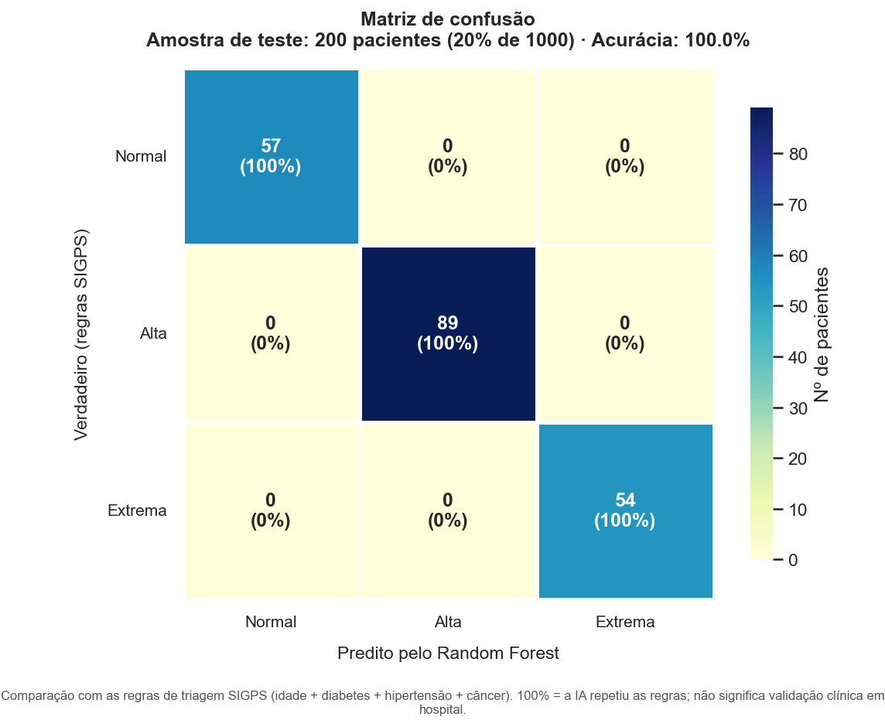
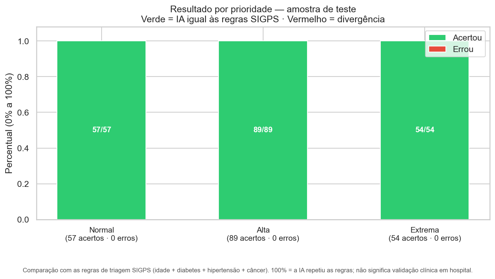
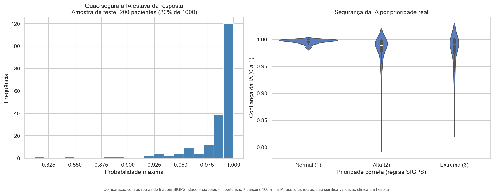
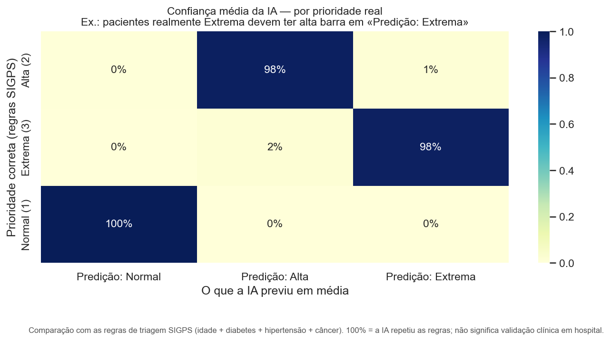
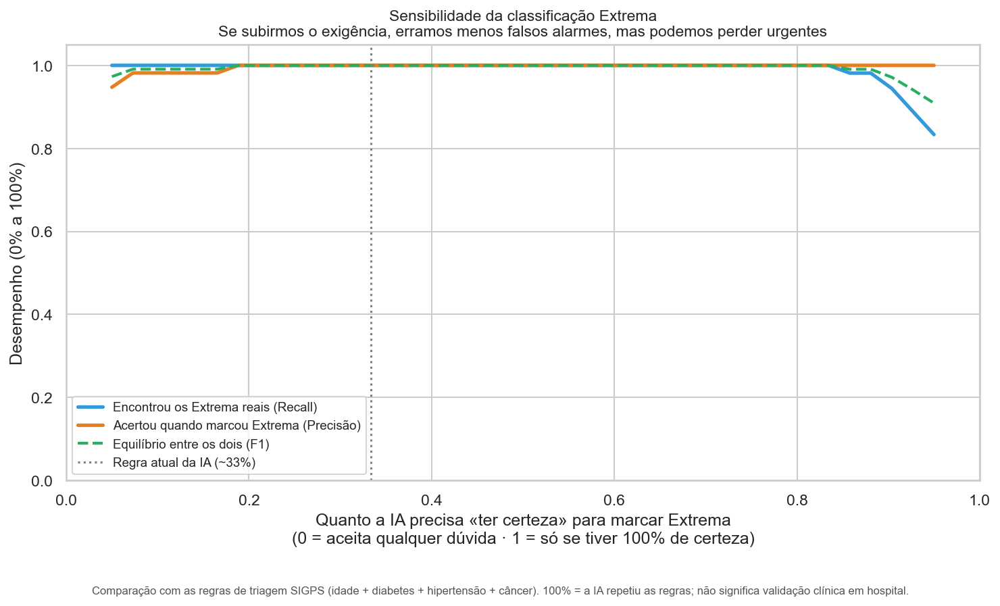
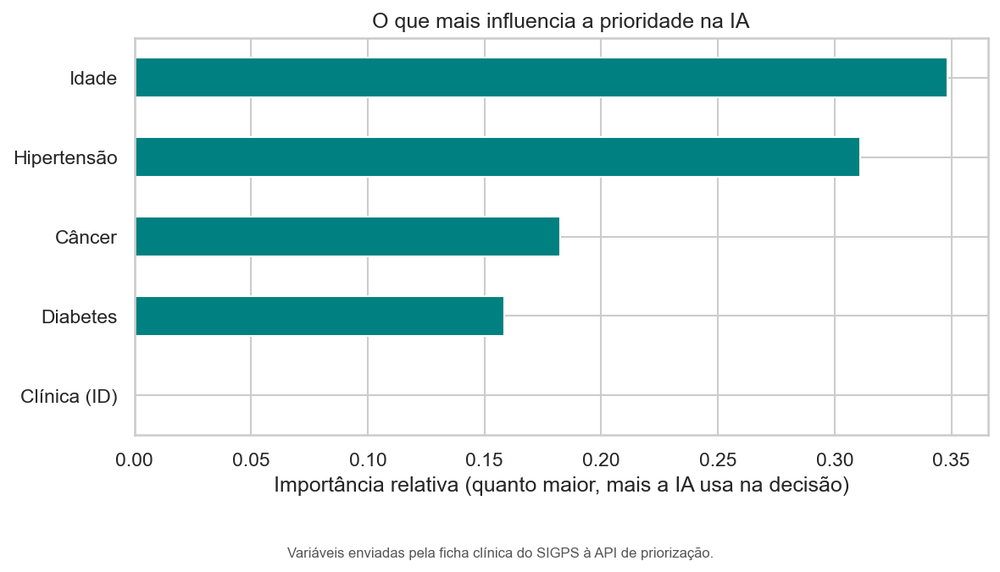
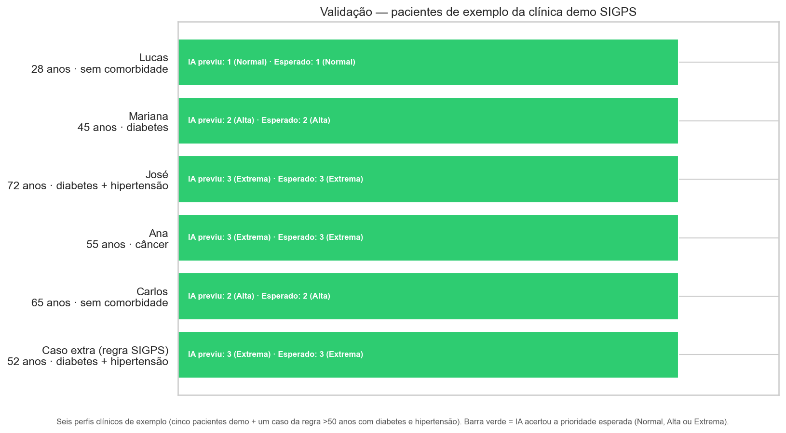
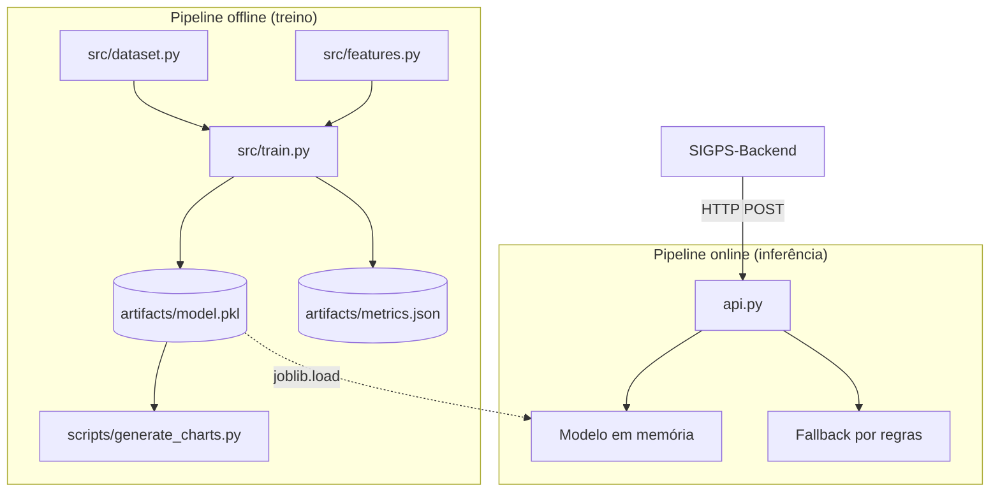
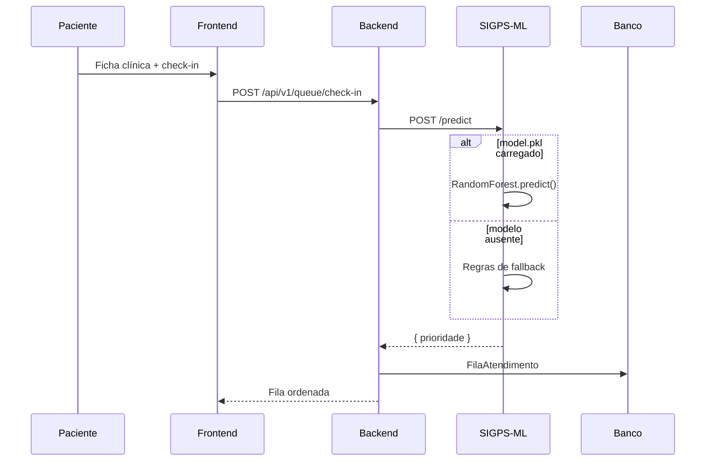

<div align="center">


# SIGPS Machine Learning

**Microserviço de IA - Random Forest para priorização clínica na fila de atendimento**

[](https://www.python.org/)
[](https://fastapi.tiangolo.com/)
[](https://scikit-learn.org/)

[README principal](../README.md) · [DOCKER.md](./DOCKER.md) · [Backend](../SIGPS-Backend/README.md) · [Frontend](../SIGPS-Frontend/README.md)

**TCC** - Faculdade Metropolitana de Manaus (FAMETRO) · Orientadora: Profª Luana Magalhães Leal

</div>

---

Este documento descreve o módulo de inteligência artificial do SIGPS: **como o modelo foi construído**, **com quais dados foi treinado**, **como foi avaliado** e **como se integra ao sistema**. A redação busca ser clara para leitores sem formação em programação ou estatística.

**Dados usados no treino atual:** 1.000 perfis de pacientes fictícios gerados para estudo (`sigps_demo_cohort_1000.csv`), no formato da ficha clínica do SIGPS. Existe também a opção de treinar com dados públicos do NHANES (CDC/EUA) - ver [§7](#7-dados-utilizados-no-treino).

---

## Sumário

### Parte I - Metodologia e resultados

1. [O problema que o SIGPS resolve](#1-o-problema-que-o-sigps-resolve)
2. [O que significa usar Machine Learning aqui](#2-o-que-significa-usar-machine-learning-aqui)
3. [Do cadastro à fila ordenada](#3-do-cadastro-à-fila-ordenada)
4. [Como o modelo foi desenvolvido](#4-como-o-modelo-foi-desenvolvido)
5. [Algoritmo escolhido e por quê](#5-algoritmo-escolhido-e-por-quê)
6. [Variáveis de entrada](#6-variáveis-de-entrada)
7. [Dados utilizados no treino](#7-dados-utilizados-no-treino)
8. [Métricas de avaliação](#8-métricas-de-avaliação)
9. [Resultados obtidos](#9-resultados-obtidos)
10. [Gráficos e interpretação](#10-gráficos-e-interpretação)
11. [Integração com o sistema SIGPS](#11-integração-com-o-sistema-sigps)
12. [Limitações, ética e papel do profissional](#12-limitações-ética-e-papel-do-profissional)
13. [Como reproduzir treino, gráficos e testes](#13-como-reproduzir-treino-gráficos-e-testes)
14. [Referências bibliográficas](#14-referências-bibliográficas)

### Parte II - Documentação técnica

15. [Stack tecnológica](#15-stack-tecnológica)
16. [Arquitetura do módulo](#16-arquitetura-do-módulo)
17. [API REST](#17-api-rest)
18. [Fluxogramas](#18-fluxogramas)
19. [Estrutura do projeto](#19-estrutura-do-projeto)
20. [Execução e deploy](#20-execução-e-deploy)
21. [Equipe](#21-equipe)

---

# Parte I - Metodologia e resultados

---

## 1. O problema que o SIGPS resolve

Em clínicas e consultórios, vários pacientes podem aguardar atendimento ao mesmo tempo. Nem todos apresentam o **mesmo risco clínico**: uma pessoa idosa com diabetes e hipertensão pode precisar de atenção antes de um adulto jovem sem comorbidades.

O **SIGPS** organiza essa fila de forma digital. A funcionalidade **Fila IA** sugere uma **ordem de atendimento** com base em informações declaradas pelo paciente na ficha clínica (idade e comorbidades), apoiando - **sem substituir** - a decisão do profissional de saúde.

### Níveis de prioridade clínica

| Código | Nome    | Significado resumido |
|--------|---------|----------------------|
| **1**  | Normal  | Atendimento padrão na triagem automatizada |
| **2**  | Alta    | Idade avançada ou comorbidades relevantes |
| **3**  | Extrema | Maior vulnerabilidade (ex.: câncer; idoso com múltiplas comorbidades) |

Esses níveis aparecem na interface como badges coloridos e determinam a **posição sugerida** na fila.

---

## 2. O que significa usar Machine Learning aqui

**Aprendizado de máquina** é uma área da inteligência artificial em que o computador **aprende padrões a partir de exemplos**, em vez de seguir apenas regras fixas escritas manualmente.

No SIGPS usamos **classificação supervisionada**:

- **Entrada:** idade e presença de diabetes, hipertensão e câncer.
- **Saída:** prioridade **1**, **2** ou **3**.
- **Supervisionado:** o modelo é treinado com exemplos que já possuem a resposta correta (a prioridade calculada pelas regras do SIGPS).

> **Analogia:** imagine mostrar milhares de fichas já classificadas por um protocolo de triagem. Depois de ver muitos casos, o sistema passa a classificar casos novos seguindo o mesmo padrão.

**Importante:** o modelo **não faz diagnóstico médico**. Ele **reproduz automaticamente** as regras de priorização já definidas no SIGPS.

---

## 3. Do cadastro à fila ordenada

```
┌─────────────────┐     ┌──────────────────┐     ┌─────────────────────┐
│ Paciente preenche│     │ Backend SIGPS    │     │ Microserviço ML     │
│ ficha (idade +  │ ──► │ envia idade e    │ ──► │ Random Forest       │
│ comorbidades)   │     │ comorbidades     │     │ retorna prioridade  │
└─────────────────┘     └────────┬─────────┘     └──────────┬──────────┘
                                 │                          │
                                 ▼                          ▼
                        ┌────────────────────────────────────────────┐
                        │ Fila reordenada na tela do especialista     │
                        │ (Extrema → Alta → Normal + tempo de espera)  │
                        └────────────────────────────────────────────┘
```

**Passos na prática:**

1. O paciente informa **idade** e **comorbidades** na ficha.
2. Ao agendar ou entrar na fila, o **backend** lê esses dados.
3. O backend envia os dados para a API de IA (`POST /predict`, porta 8000).
4. O modelo devolve prioridade **1**, **2** ou **3**.
5. A fila é atualizada na tela **Fila de Espera**.
6. Se a API estiver offline, o sistema usa **regras clínicas locais** (mesma lógica das regras de treino) - o atendimento **não para**.

---

## 4. Como o modelo foi desenvolvido

| Etapa | O que foi feito | Arquivo / artefato |
|-------|-----------------|-------------------|
| **1** | Definir quais dados entram no modelo (idade, comorbidades) | `src/features.py` |
| **2** | Formalizar as regras de prioridade do SIGPS | `src/priority_rules.py` |
| **3** | Preparar os dados de treino (1.000 perfis ou NHANES) | `data/processed/` |
| **4** | Separar 80% para treino e 20% para teste | `src/train.py` |
| **5** | Treinar o **Random Forest** | `src/train.py` |
| **6** | Calcular métricas e matriz de confusão | `artifacts/metrics.json` |
| **7** | Salvar o modelo treinado | `artifacts/model.pkl` |
| **8** | Disponibilizar inferência via API | `api.py` |
| **9** | Gerar gráficos de avaliação | `scripts/generate_charts.py` |
| **10** | Integrar ao backend e testar na interface | `SIGPS-Backend/` |

---

## 5. Algoritmo escolhido e por quê

### Modelo adotado: **Random Forest** (Floresta Aleatória)

Implementação: `sklearn.ensemble.RandomForestClassifier` (biblioteca **scikit-learn**).

| Configuração | Valor | Motivo |
|--------------|-------|--------|
| Número de árvores | 150 | Equilíbrio entre precisão e tempo de resposta |
| Profundidade máxima | 12 | Evita memorizar casos isolados |
| Peso das classes | balanceado | A classe Extrema é menos frequente - o modelo não deve ignorá-la |
| Semente aleatória | 42 | Permite repetir o mesmo treino e obter o mesmo resultado |

### Comparação com outras abordagens

| Abordagem | Vantagem | Por que não foi a principal |
|-----------|----------|----------------------------|
| **Regras fixas** | Simples e transparente | Já existem no SIGPS como reserva; o ML automatiza a mesma lógica |
| **Regressão logística** | Rápida | Relações mais lineares; menos flexível para combinações de idade e comorbidades |
| **Redes neurais profundas** | Muito flexíveis | Exigem muito mais dados; difícil de explicar |
| **Random Forest** ✓ | Robusta, aceita variáveis mistas, mostra **o que mais influencia** a decisão | Adequada ao volume de dados e ao contexto clínico |

A Floresta Aleatória combina centenas de **árvores de decisão**. Cada árvore vota na classe; a classe mais votada vence.

---

## 6. Variáveis de entrada

O modelo recebe **cinco informações** por paciente - as mesmas enviadas pelo backend:

| Variável | Tipo | Origem no SIGPS | Papel |
|----------|------|-----------------|-------|
| `idade` | Número inteiro | Data de nascimento na ficha | Idosos tendem a maior prioridade |
| `tem_diabetes` | 0 ou 1 | Comorbidade declarada | Fator de risco metabólico |
| `tem_hipertensao` | 0 ou 1 | Comorbidade declarada | Fator cardiovascular |
| `tem_cancer` | 0 ou 1 | Comorbidade declarada | Elevado impacto na triagem |
| `organization_id` | Número inteiro | Clínica selecionada | Compatibilidade com a API; no treino usa valor fixo para não criar diferença artificial entre clínicas |

### Por que a ficha tem 9 comorbidades e a IA usa só 3?

Na tela **Informações clínicas** aparecem **9 condições** - diabetes, hipertensão, câncer, cardiopatia, asma/DPOC, doença renal, obesidade, epilepsia e doença autoimune. Apenas **3** entram no modelo de priorização (as marcadas com badge **IA** na interface).

| Aspecto | Ficha clínica (9 opções) | Fila IA (3 comorbidades) |
|---------|--------------------------|---------------------------|
| **Objetivo** | Prontuário completo para o profissional | Priorização automática na fila |
| **Quem usa** | Médico, enfermeiro, histórico | Microserviço de IA + regras de reserva |
| **Condições na IA** | Diabetes, hipertensão, câncer | Mesmas 3 + idade |
| **Demais condições** | Registradas na ficha | Ainda não entram no algoritmo (versão 1) |

**Por que só 3 comorbidades na versão atual?**

1. **Dados disponíveis** - pesquisas de saúde pública (como o NHANES) perguntam explicitamente sobre diabetes, pressão alta e câncer.
2. **Escopo inicial** - poucas variáveis reduzem complexidade e facilitam auditoria do modelo.
3. **Relevância clínica** - diabetes, hipertensão e câncer são prevalentes e têm impacto conhecido na vulnerabilidade do paciente.
4. **Evolução futura** - outras condições já ficam no prontuário e podem ser incluídas em versões posteriores, após validação clínica.

---

## 7. Dados utilizados no treino

### Opção principal - 1.000 perfis de estudo (SIGPS)

| Aspecto | Detalhe |
|---------|---------|
| **O que são** | Perfis **fictícios** gerados no banco do SIGPS para treinar e testar o modelo |
| **Quantidade** | 1.000 pacientes |
| **Clínica** | Clínica Demo Fila IA |
| **Arquivo** | `data/processed/sigps_demo_cohort_1000.csv` |
| **Formato** | Idade, diabetes, hipertensão, câncer, clínica, prioridade |
| **Prioridade correta** | Calculada pelas **regras do SIGPS** (`src/priority_rules.py`) - mesmas regras usadas na fila quando a IA está offline |

**Distribuição das prioridades (1.000 perfis):** Normal 287 · Alta 444 · Extrema 269.

> Estes perfis **não são prontuários reais**. Servem para treinar o modelo no **mesmo formato** da ficha clínica do SIGPS.

### Opção alternativa - NHANES (dados públicos dos EUA)

| Aspecto | Detalhe |
|---------|---------|
| **Fonte** | [NHANES - CDC/NCHS](https://wwwn.cdc.gov/nchs/nhanes/) (dados abertos do governo dos EUA) |
| **Quantidade** | 10.955 adultos (18–89 anos), após limpeza |
| **Arquivo** | `data/processed/nhanes_sigps_training.csv` |
| **Script** | `python scripts/prepare_nhanes_dataset.py` |

O NHANES **não possui** coluna “prioridade de fila”. Por isso, após extrair idade e comorbidades reais, aplicamos o **protocolo de triagem SIGPS** para gerar as classes 1, 2 e 3.

### Regras que definem a prioridade correta

```
SE tem câncer
   OU (idade ≥ 60 E diabetes ou hipertensão)
   OU (idade > 50 E diabetes E hipertensão)
   → Prioridade 3 (Extrema)

SENÃO SE idade ≥ 60 OU diabetes OU hipertensão
   → Prioridade 2 (Alta)

SENÃO
   → Prioridade 1 (Normal)
```

### Divisão treino / teste

- **80%** dos dados → treino (800 pacientes, no conjunto de 1.000)
- **20%** → teste (200 pacientes)
- A divisão mantém a **mesma proporção** de Normal, Alta e Extrema em treino e teste (`random_state=42`)

---

## 8. Métricas de avaliação

> **Antes de interpretar os 100%:** a avaliação mede se o modelo **repete corretamente as regras do SIGPS**, e **não** se concorda com um parecer médico independente.

### O que estamos medindo

| Pergunta | Resposta |
|----------|----------|
| O modelo descobriu padrões desconhecidos? | **Não** - a prioridade correta foi gerada pelas **mesmas regras** que o modelo aprende |
| Então por que usar IA? | Integração na API, resposta rápida e mesma lógica das regras, de forma automatizada |
| O que valida o sistema na prática? | Seis perfis de exemplo integrados ao produto (gráfico §10.7) |

### Acurácia

De cada 100 pacientes do teste, quantos o modelo classificou corretamente? **Resultado atual: 100%.**

### Precisão

Quando o modelo diz **Extrema**, com que frequência está certo?

### Recall (sensibilidade)

De todos que **realmente** são Extrema, quantos o modelo identificou? **Resultado atual: 100%.**

### F1-score

Combina precisão e recall em um único número. Quanto mais perto de 100%, melhor o equilíbrio entre acertar quando prediz e não deixar casos passarem.

| Métrica | Significado simples |
|---------|---------------------|
| **F1 macro** | Média do desempenho nas três prioridades (Normal, Alta, Extrema), com peso igual |
| **F1 weighted** | Mesma lógica, mas prioridades com mais pacientes no teste pesam mais |

### Matriz de confusão

Tabela que compara a prioridade **correta** (linhas) com a prioridade **prevista pelo modelo** (colunas). Números **na diagonal** = acertos; **fora da diagonal** = erros.

---

## 9. Resultados obtidos

Valores em `artifacts/metrics.json` (após `python -m src.train`):

| Métrica | Valor |
|---------|-------|
| **Acurácia** | 100% |
| **F1 macro** | 100% |
| **F1 weighted** | 100% |
| **Recall classe Extrema** | 100% |
| **Conjunto de dados** | 1.000 perfis fictícios (Clínica Demo Fila IA) |
| **Treino / teste** | 800 / 200 |
| **Algoritmo** | Random Forest |

### Desempenho por prioridade (teste - 200 pacientes)

| Prioridade | Precisão | Recall | F1 | Pacientes no teste |
|------------|----------|--------|-----|-------------------|
| Normal     | 100%     | 100%   | 100% | 57 |
| Alta       | 100%     | 100%   | 100% | 89 |
| Extrema    | 100%     | 100%   | 100% | 54 |

### Matriz de confusão (contagens - teste)

|  | Previsto Normal | Previsto Alta | Previsto Extrema |
|--|-----------------|---------------|------------------|
| **Real Normal** | **57** | 0 | 0 |
| **Real Alta** | 0 | **89** | 0 |
| **Real Extrema** | 0 | 0 | **54** |

### Por que a acurácia é 100%?

1. **A resposta correta vem das regras do SIGPS** - o modelo aprende a repetir esse protocolo.
2. **100% significa fidelidade ao protocolo**, não “IA clínica perfeita”.
3. **Os 1.000 perfis são fictícios**, alinhados ao formato da ficha - não são prontuários hospitalares reais.
4. **Isso não prova** que o protocolo SIGPS é o melhor critério clínico universal, nem substitui validação com especialistas.

**Gráficos:** `python scripts/generate_charts.py` → `artifacts/*.png` (7 imagens). Interpretação na [§10](#10-gráficos-e-interpretação).

---

## 10. Gráficos e interpretação

Gerados por `python scripts/generate_charts.py`. Salvos em `artifacts/`.

| # | Arquivo | O que mostra |
|---|---------|--------------|
| 1 | `confusion_matrix.png` | Acertos e erros por prioridade no teste (200 pacientes) |
| 2 | `taxas_erro_classe.png` | Percentual de acerto em Normal, Alta e Extrema |
| 3 | `distribuicao_probabilidades.png` | Quão seguro o modelo estava da resposta |
| 4 | `heatmap_probabilidades.png` | Probabilidade média atribuída a cada prioridade |
| 5 | `curva_limiar_extrema.png` | Efeito de exigir mais certeza para marcar Extrema |
| 6 | `feature_importance.png` | Quais variáveis mais influenciam a decisão |
| 7 | `validacao_casos_sigps.png` | Seis perfis de exemplo do sistema |

**Dois tipos de avaliação:**

1. **Gráficos 1 a 6** - análise dos **200 pacientes de teste** (parte dos 1.000 perfis de estudo).
2. **Gráfico 7** - seis **casos nomeados** integrados ao produto (cinco contas de demonstração + um caso extra).

> Os gráficos medem se o Random Forest **reproduz o protocolo de triagem SIGPS**. Não medem acerto contra laudo médico externo.

---

### 10.1 Matriz de confusão



Compara a **prioridade correta (regras SIGPS)** com a **prioridade prevista pelo modelo** na amostra de teste. Cada célula traz a quantidade de pacientes e o percentual da linha. Valores na **diagonal** indicam acertos (Normal→Normal, Alta→Alta, Extrema→Extrema). Valores fora da diagonal seriam erros - neste experimento não houve nenhum.

---

### 10.2 Resultado por prioridade



Três barras (Normal, Alta, Extrema): parte **verde** = acertos; parte **vermelha** = erros. Permite ver rapidamente se alguma prioridade teve mais dificuldade - o que seria especialmente crítico para a classe Extrema.

---

### 10.3 Distribuição da confiança do modelo



**Esquerda:** histograma de quão “seguro” o modelo estava (0 a 100%). **Direita:** confiança separada por prioridade real. Valores próximos de 100% indicam decisões firmes; valores baixos indicariam dúvida entre as três classes.

---

### 10.4 Confiança média por prioridade



Para cada prioridade real (linhas), mostra em média o quanto o modelo atribuiu a Normal, Alta e Extrema (colunas). Na linha “Extrema”, espera-se valor alto na coluna Extrema - indica coerência entre a classe correta e a confiança do modelo.

---

### 10.5 Sensibilidade da classificação Extrema



Simula exigir **mais certeza** antes de marcar alguém como Extrema. Mostra como mudam: quantos Extrema reais são encontrados (recall), quantos acertos ao marcar Extrema (precisão) e o equilíbrio entre os dois (F1). Útil para discutir políticas mais conservadoras de triagem em versões futuras.

---

### 10.6 Importância das variáveis



Mostra quanto cada variável (idade, diabetes, hipertensão, câncer) contribuiu para a decisão do Random Forest. Barras maiores = variável mais usada. Espera-se destaque para idade e comorbidades - coerente com as regras de triagem do SIGPS.

---

### 10.7 Validação com perfis de exemplo



Seis perfis clínicos de exemplo. Barra **verde** = modelo acertou a prioridade esperada; **vermelha** = erro.

| Nome | Descrição | Prioridade esperada |
|------|-----------|---------------------|
| Lucas | 28 anos, sem comorbidade | Normal (1) |
| Mariana | 45 anos, diabetes | Alta (2) |
| José | 72 anos, diabetes + hipertensão | Extrema (3) |
| Ana | 55 anos, câncer | Extrema (3) |
| Carlos | 65 anos, sem comorbidade | Alta (2) |
| Caso extra | 52 anos, diabetes + hipertensão | Extrema (3) |

Os cinco primeiros possuem contas de demonstração no sistema (e-mails na [§11](#11-integração-com-o-sistema-sigps)). O sexto caso existe apenas para testar a regra “mais de 50 anos com diabetes e hipertensão”.

Os **1.000 perfis de estudo** aparecem nos gráficos 1 a 6, não neste gráfico 7.

---

## 11. Integração com o sistema SIGPS

| Componente | Papel |
|------------|-------|
| `SIGPS-Frontend` | Ficha clínica, Fila de Espera, badges de prioridade |
| `SIGPS-Backend` | Envia dados do paciente para a IA |
| `SIGPS-Machine-Learning` | API na porta **8000**, rota `/predict` |
| Configuração | `ML_API_URL=http://127.0.0.1:8000/predict` no `.env` do backend |

### Onde o usuário vê o resultado

| Tela | Rota | O que exibe |
|------|------|-------------|
| Fila de espera | `/painel/fila` | Ordem por prioridade, badge “IA” |
| Gestão IA | `/painel/gestao-ia` | Monitoramento da priorização |

### Contas de demonstração

| Nome | E-mail | Senha | Prioridade |
|------|--------|-------|------------|
| Lucas | `pac.normal@sigps.test` | `TesteFila@2026` | Normal (1) |
| Mariana | `pac.alta1@sigps.test` | `TesteFila@2026` | Alta (2) |
| José | `pac.extrema1@sigps.test` | `TesteFila@2026` | Extrema (3) |
| Ana | `pac.extrema2@sigps.test` | `TesteFila@2026` | Extrema (3) |
| Carlos | `pac.alta2@sigps.test` | `TesteFila@2026` | Alta (2) |
| Gestor | `demo.fila@sigps.test` | `TesteFila@2026` | Visualiza a fila |

Clínica: **Clínica Demo Fila IA**

---

## 12. Limitações, ética e papel do profissional

1. **Dados fictícios ou estrangeiros** - os 1.000 perfis são gerados para estudo; o NHANES é dos EUA. Nenhum substitui prontuários reais brasileiros.
2. **Prioridade definida por regras** - o modelo aprende a repetir o protocolo SIGPS, não um parecer clínico independente.
3. **Só 3 comorbidades na IA** - outras condições da ficha ainda não entram no algoritmo (versão 1).
4. **Apoio à decisão** - a IA **sugere ordem**; o profissional de saúde decide o atendimento.
5. **LGPD** - comorbidades declaradas pelo titular; dados mascarados para a equipe quando aplicável.
6. **Reserva offline** - regras locais se a API de IA estiver indisponível.
7. **Prioridade de fila ≠ diagnóstico médico.**

---

## 13. Como reproduzir treino, gráficos e testes

```powershell
cd SIGPS-Machine-Learning
pip install -r requirements.txt
python -m src.train
python scripts/generate_charts.py
python api.py
```

**Dados alternativos (NHANES):** `python scripts/prepare_nhanes_dataset.py` antes do treino.

**Gerar os 1.000 perfis no banco:** `python scripts/seed_ml_study_cohort.py` no SIGPS-Backend.

**Contas de teste na interface:** `python scripts/seed_fila_ia_test.py` no SIGPS-Backend.

### Enviar modelo para a VPS (produção)

O container de produção monta `artifacts/model.pkl` por volume — **basta copiar o arquivo e reiniciar**, sem rebuild da imagem.

**1. Configure uma vez:**

```powershell
cd SIGPS-Machine-Learning
copy scripts\deploy.env.example scripts\deploy.env
# Edite: VPS_USER, VPS_HOST, VPS_ML_DIR (ex.: /opt/sigps/SIGPS-Machine-Learning)
```

**2. Envie o modelo:**

```powershell
.\scripts\enviar_modelo_vps.ps1
# ou, treinando antes:
.\scripts\enviar_modelo_vps.ps1 -Treinar
```

Linux/macOS: `bash scripts/enviar_modelo_vps.sh`

**Manual (sem script):**

```powershell
scp artifacts/model.pkl usuario@SUA_VPS:/opt/sigps/SIGPS-Machine-Learning/artifacts/
ssh usuario@SUA_VPS "docker restart sigps-ml"
```

Na resposta de `/health` dentro do container, confira `"model_loaded": true`.

**Primeira subida na VPS** (só uma vez):

```bash
cd SIGPS-Machine-Learning
docker compose -f docker-compose.prod.yml up -d --build
```

Certifique-se de que `artifacts/model.pkl` existe antes do `up` (volume exige o arquivo).

---

## 14. Referências bibliográficas

- BREIMAN, L. Random Forests. *Machine Learning*, 2001.
- CENTERS FOR DISEASE CONTROL AND PREVENTION. *National Health and Nutrition Examination Survey (NHANES)*. https://wwwn.cdc.gov/nchs/nhanes/
- GÉRON, A. *Hands-On Machine Learning with Scikit-Learn, Keras, and TensorFlow*. O'Reilly.
- BRASIL. Lei nº 13.709/2018 (LGPD).
- SCIKIT-LEARN DEVELOPERS. *User Guide - Ensemble methods*.
- WORLD HEALTH ORGANIZATION. *Triage systems*.

---

# Parte II - Documentação técnica

---

## 15. Stack tecnológica

| Tecnologia | Uso |
|------------|-----|
| Python 3.10+ | Runtime |
| FastAPI + Uvicorn | API REST de inferência |
| scikit-learn | `RandomForestClassifier` |
| pandas / numpy | Dados e variáveis |
| joblib | Serialização `artifacts/model.pkl` |
| Pydantic | Validação do payload `/predict` |

---

## 16. Arquitetura do módulo

Este módulo roda na porta **8000**. O backend envia `POST /predict` e persiste o resultado em `fila_atendimento`.



---

## 17. API REST

| Método | Rota | Descrição |
|--------|------|-----------|
| `GET` | `/health` | Status da API e se o modelo foi carregado |
| `POST` | `/predict` | Recebe dados do paciente; retorna `{ "prioridade": 1\|2\|3 }` |

**Request:**

```json
POST /predict
{
  "idade": 72,
  "tem_diabetes": 1,
  "tem_hipertensao": 1,
  "tem_cancer": 0,
  "organization_id": 3
}
```

**Response:**

```json
{ "prioridade": 3 }
```

Documentação interativa: `http://127.0.0.1:8000/docs`

---

## 18. Fluxogramas

### Sequência: check-in à fila priorizada



---

## 19. Estrutura do projeto

```
SIGPS-Machine-Learning/
├── README.md
├── api.py
├── scripts/
│   ├── generate_charts.py
│   ├── enviar_modelo_vps.ps1      # Envia model.pkl para VPS + restart
│   ├── enviar_modelo_vps.sh
│   ├── deploy.env.example
│   └── prepare_nhanes_dataset.py
├── artifacts/
│   ├── model.pkl
│   ├── metrics.json
│   └── *.png
├── core/path.py
├── src/
│   ├── train.py
│   ├── dataset.py
│   ├── priority_rules.py
│   └── features.py
├── data/processed/
│   ├── sigps_demo_cohort_1000.csv
│   └── nhanes_sigps_training.csv
└── requirements.txt
```

---

## 20. Execução e deploy

```powershell
cd SIGPS-Machine-Learning
python -m venv .venv
.venv\Scripts\activate
pip install -r requirements.txt
python -m src.train
python api.py
```

**Backend (.env):** `ML_API_URL=http://127.0.0.1:8000/predict`

**Produção (Docker):** `docker compose -f docker-compose.prod.yml up -d --build`

**Atualizar só o modelo na VPS:** [§13 — Enviar modelo para a VPS](#enviar-modelo-para-a-vps-produção)

Sem `model.pkl`, a API usa **regras de reserva** (`priority_rules.py`). Detalhes em [DOCKER.md](./DOCKER.md).

---

## 21. Equipe

Projeto desenvolvido como **TCC** pela **Faculdade Metropolitana de Manaus**.

| Integrante | Papel |
|------------|-------|
| Josias Azevedo da Silva | Product Owner & Desenvolvedor Full-Stack |
| Kaio Oliveira Pantoja | Scrum Master & Tech Lead |
| Wagner Eduardo | Documentação |
| Matheus Akabane Brazão | Desenvolvedor Back-end |
| Ólliver de Aquino Freitas | Front-end UX/UI |
| Alan Nicolas Santos Maragua | QA |

**Orientadora:** Profª Luana Magalhães Leal

---

<div align="center">

**SIGPS - Machine Learning** · Priorização clínica com Random Forest

[← README principal](../README.md)

</div>
