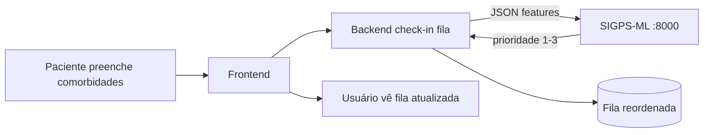
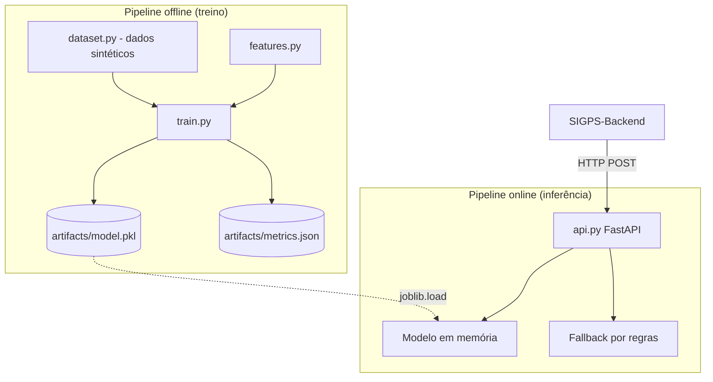
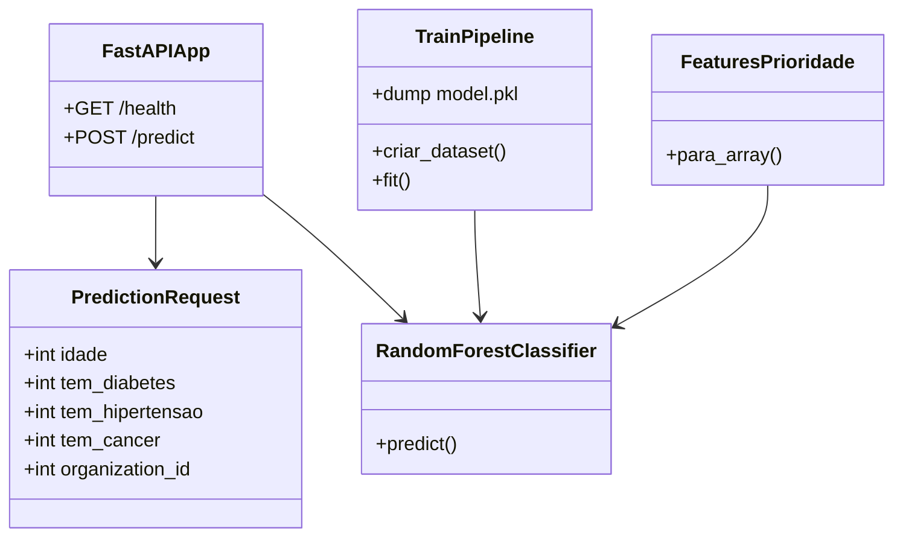
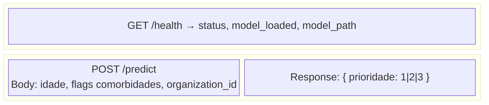
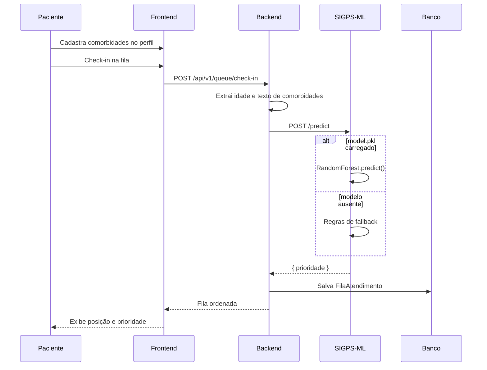
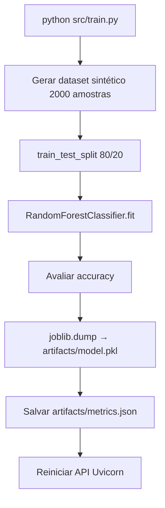
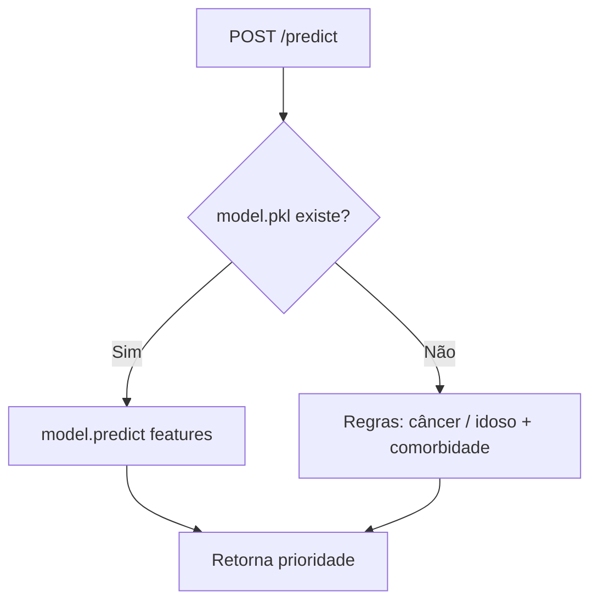
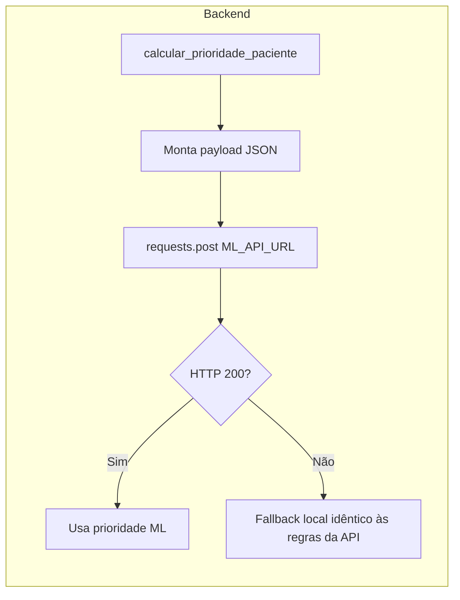

<div align="center">


# SIGPS Machine Learning

**Microserviço de IA - Random Forest para priorização clínica na fila de atendimento**

[](https://www.python.org/)
[](https://fastapi.tiangolo.com/)
[](https://scikit-learn.org/)

[README principal](../README.md) · [DOCKER.md](./DOCKER.md) · [Backend](../SIGPS-Backend/README.md) · [Frontend](../SIGPS-Frontend/README.md)

**TCC** - Faculdade Metropolitana de Manaus · Orientadora: Profª Luana Magalhães Leal

</div>

---

Treina e expõe um modelo **Random Forest** para classificar a **prioridade clínica** (níveis 1, 2 e 3), consumido pelo backend Flask via HTTP.

---

## Índice

1. [Visão geral](#visão-geral)
2. [Stack tecnológica](#stack-tecnológica)
3. [Arquitetura do módulo ML](#arquitetura-do-módulo-ml)
4. [Apresentação das “telas” (API)](#apresentação-das-telas-api)
5. [Fluxogramas](#fluxogramas)
6. [Modelo e features](#modelo-e-features)
7. [Como executar](#como-executar)
8. [Estrutura do projeto](#estrutura-do-projeto)

---

## Visão geral

Este módulo roda **de forma independente** na porta **8000**. O backend não carrega o `.pkl` diretamente: envia um `POST` para `/predict` e persiste o resultado em `fila_atendimento`.



### Níveis de prioridade

| Código | Categoria | Uso clínico (resumo) |
|--------|-----------|----------------------|
| **1** | Normal | Atendimento padrão |
| **2** | Alta | Fatores de risco moderados |
| **3** | Extrema | Idoso com comorbidades graves ou câncer |

---

## Stack tecnológica

| Tecnologia | Uso |
|------------|-----|
| Python 3.10+ | Runtime |
| FastAPI | API REST de inferência |
| Uvicorn | Servidor ASGI |
| scikit-learn | RandomForestClassifier |
| pandas / numpy | Dataset e features |
| joblib | Serialização do modelo (`.pkl`) |
| Pydantic | Validação do payload `/predict` |

---

## Arquitetura do módulo ML



### Diagrama de classes



---

## Apresentação das “telas” (API)

O módulo ML não possui interface gráfica própria; a “apresentação” ocorre via **endpoints REST** e pelo **painel do frontend** (Fila de Espera / Gestão IA).

### Endpoints

| “Tela” lógica | Método | Rota | Descrição |
|---------------|--------|------|-----------|
| **Status do serviço** | `GET` | `/health` | Verifica se a API está no ar e se o modelo foi carregado. |
| **Inferência** | `POST` | `/predict` | Recebe features e retorna `prioridade` (1, 2 ou 3). |

#### Wireframe — Resposta visual no Swagger / cliente HTTP



### Onde o usuário vê o resultado (Frontend)

| Tela SIGPS | Rota frontend | O que exibe da IA |
|------------|---------------|-------------------|
| **Fila de espera** | `/painel/fila` | Ordem por prioridade, badge “IA automática”, card de análise |
| **Gestão IA** | `/painel/gestao-ia` | Monitoramento auxiliar da priorização |
| **Check-in** | Ação na fila | Prioridade calculada no momento do check-in |

### Exemplo de requisição e resposta

**Request:**

```json
POST /predict
{
  "idade": 72,
  "tem_diabetes": 1,
  "tem_hipertensao": 1,
  "tem_cancer": 0,
  "organization_id": 3
}
```

**Response:**

```json
{
  "prioridade": 3
}
```

### Capturas para documentação (TCC)

Salve prints de testes em:

```
SIGPS-Machine-Learning/docs/screenshots/
├── 01-swagger-health.png
├── 02-swagger-predict.png
├── 03-fila-frontend-resultado.png
└── 04-metrics-json.png
```

---

## Fluxogramas

### Fluxo completo: do cadastro à fila priorizada



### Fluxo de treinamento (offline)



### Fluxo de inferência com fallback



### Integração no backend (`fila_helpers.py`)



---

## Modelo e features

### Features de entrada (`ORDEM_FEATURES`)

| Feature | Tipo | Origem no SIGPS |
|---------|------|-----------------|
| `idade` | int | Calculada a partir de `data_nascimento` |
| `tem_diabetes` | 0/1 | Texto de `comorbidades` |
| `tem_hipertensao` | 0/1 | Texto de `comorbidades` |
| `tem_cancer` | 0/1 | Texto de `comorbidades` |
| `organization_id` | int | Contexto da unidade de saúde |

### Artefatos gerados

```
artifacts/
├── model.pkl      # Modelo treinado (não versionado no git)
└── metrics.json   # Accuracy, ordem das features, contagem treino/teste
```

---

## Como executar

### 1. Ambiente

```bash
python -m venv .venv
# Windows
.venv\Scripts\activate
# Linux/Mac
source .venv/bin/activate

pip install -r requirements.txt
```

Instale também dependências da API (se usar ambiente mínimo):

```bash
pip install fastapi uvicorn joblib scikit-learn pydantic
```

### 2. Treinar o modelo (obrigatório na primeira vez)

```bash
python src/train.py
```

### 3. Subir a API

```bash
python -m uvicorn api:app --reload --port 8000
```

- Health: `http://127.0.0.1:8000/health`
- Docs interativas: `http://127.0.0.1:8000/docs`

### 4. Configurar o backend

No `.env` do **SIGPS-Backend**:

```env
ML_API_URL=http://127.0.0.1:8000/predict
```

Em Docker na mesma rede: `http://sigps-ml:8000/predict`

### Produção (exemplo PM2)

```bash
pm2 start "python -m uvicorn api:app --host 0.0.0.0 --port 8000" --name sigps-ml
pm2 save
```

### Docker

```bash
# Coloque model.pkl em artifacts/ antes do build (opcional)
docker compose up -d --build
```

Sem modelo, a API usa **fallback por regras** (comportamento documentado em `api.py`).

---

## Estrutura do projeto

```
SIGPS-Machine-Learning/
├── api.py                 # FastAPI — /health e /predict
├── artifacts/
│   ├── model.pkl          # Gerado pelo treino
│   └── metrics.json
├── core/
│   └── path.py            # Caminhos dos artefatos
├── src/
│   ├── train.py           # Pipeline de treinamento
│   ├── dataset.py         # Geração de dados sintéticos
│   ├── features.py        # Contrato de features
│   ├── evaluate.py
│   └── export.py
├── requirements.txt
├── Dockerfile
└── docker-compose.yml
```

---

## Módulos relacionados

| Repositório | Função |
|-------------|--------|
| [SIGPS-Backend](../SIGPS-Backend/README.md) | Chama `/predict` e persiste a fila |
| [SIGPS-Frontend](../SIGPS-Frontend/README.md) | Exibe fila ordenada e análise IA |

---

## Equipe

Projeto desenvolvido como **Trabalho de Conclusão de Curso (TCC)** pela **Faculdade Metropolitana de Manaus**.

| Integrante | Papel |
|------------|-------|
| Josias Azevedo da Silva | Product Owner & Desenvolvedor Full-Stack |
| Kaio Oliveira Pantoja | Scrum Master & Tech Lead |
| Wagner Eduardo | Documentação |
| Matheus Akabane Brazão | Desenvolvedor Back-end |
| Ólliver de Aquino Freitas | Front-end UX/UI |
| Alan Nicolas Santos Maragua | QA — Quality Assurance |

### Orientação

**Professora orientadora:** Profª Luana Magalhães Leal — Tech Manager & Profª de Tecnologia

---

<div align="center">

**SIGPS** - Trabalho de Conclusão de Curso · Classificação de prioridade clínica com Machine Learning

[← Voltar ao README principal](../README.md)

</div>
